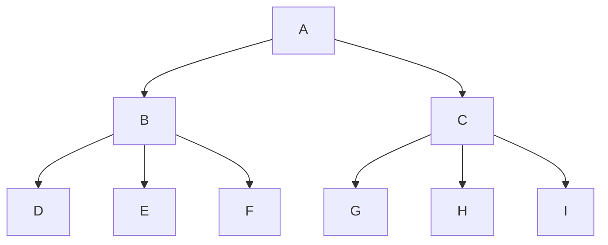

### Screenshot:


---

### Heading test:

# Basic h1
## Basic h2

Alternative h1
==============

Alternative h2
--------------

### Emphasis test:

**bold 1**
__bold 2__
bol**d** 3

*italic 1*
_italic 2_
itali*c* 3

### Lists test:

1. Item 1
2. Item 2
   - Item
   - Item

### Code test:

```c#
string x = "Times New Roman";
Console.WriteLine(x);
```

### Here comes tables test:

| Left aligned | center aligned | right aligned |
| :----------- | :------------: | ------------: |
| qwerty       | 123            | &^$432^&      |

### Blockquotes test:

> ### I am commiting on unprotected **main** branch 
> haha
> > ~~I am commiting a crime~~
> > > More _reddit_ alike formatting

### Formula test:

$$
x_{1,2} = { \cos\theta \over \sqrt{1-2^y} * d^5p}
$$

### Special symbols test:

\# \\ \_ \. \!

### Links test:

[Exercises](https://www.markdowntutorial.com/lesson/1/)

### Diff coloring test:

```diff
+ green
- not green
! also not green
```

### Task sheet test:

- [x] done
- [ ] not done

### Graph test:


